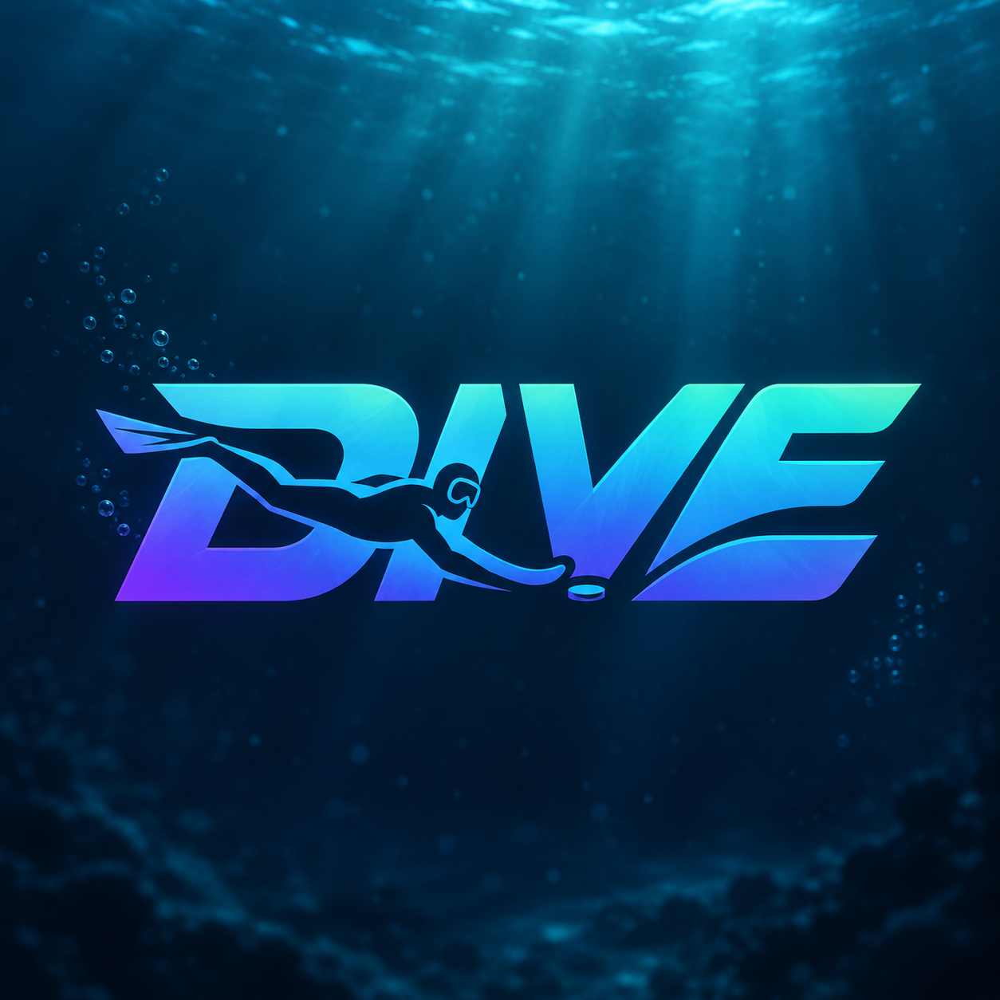

# DIVE 🌊

### An underwater hockey game inspired by Solana.

I’ve been following Solana and its ecosystem, and when I heard about the **V1 transaction update**, I wanted to explore it through something people could actually play.

---

## What is DIVE?

DIVE is a **first-person underwater hockey game** you can play in your browser.

You enter the pool with two computer-controlled teammates and face an opposing team of three. Swim into position, pass the puck, steal possession, and take your shot.

**First to three goals wins.**

With the backend connected, actions such as passes, steals, shots, and goals create **real Solana V1 transaction receipts on Devnet**. A small panel lets you follow those receipts and open them on Solscan.

**No wallet connection is needed to play.**

---

## Why I’m building it

I learn best by making things.

DIVE gives me a reason to explore Solana, understand how blockchain transactions fit into an interactive experience, and learn about game development along the way.

The part I find most satisfying is simple: something happens in the pool, and I can see its receipt on Devnet.

This is a hobby project. I’m figuring things out as I go, trying ideas, making mistakes, and improving the game with each version.

I wanted to contribute something playful to an ecosystem I enjoy being around.

---

## Why Solana?

I believe **Solana can be a big part of the future of gaming**.

I’m interested in what becomes possible when games can connect player actions to a shared, public record while keeping the experience easy to enter and fun to play.

DIVE is my small experiment in that direction. It uses the **V1 transaction format** to record match events, giving players a visible connection between what happens in the game and what appears on Devnet.

There’s a lot more to explore, and that’s what makes me want to keep building.

---

## See the game on Devnet

DIVE’s sponsor wallet has recorded real transactions from local match testing.

### [↗ Explore DIVE’s wallet on Solscan](https://solscan.io/account/8TbdK7Yc3QvgxpCycF3TBy8jZnUF5bTC8vpah5dn1Y9V?cluster=devnet)

```
8TbdK7Yc3QvgxpCycF3TBy8jZnUF5bTC8vpah5dn1Y9V
```

These are **Devnet transactions using test SOL**. The wallet sponsors the receipts so players don’t need to bring their own funds.

---

**Built for fun. Built to learn. Inspired by Solana.**
