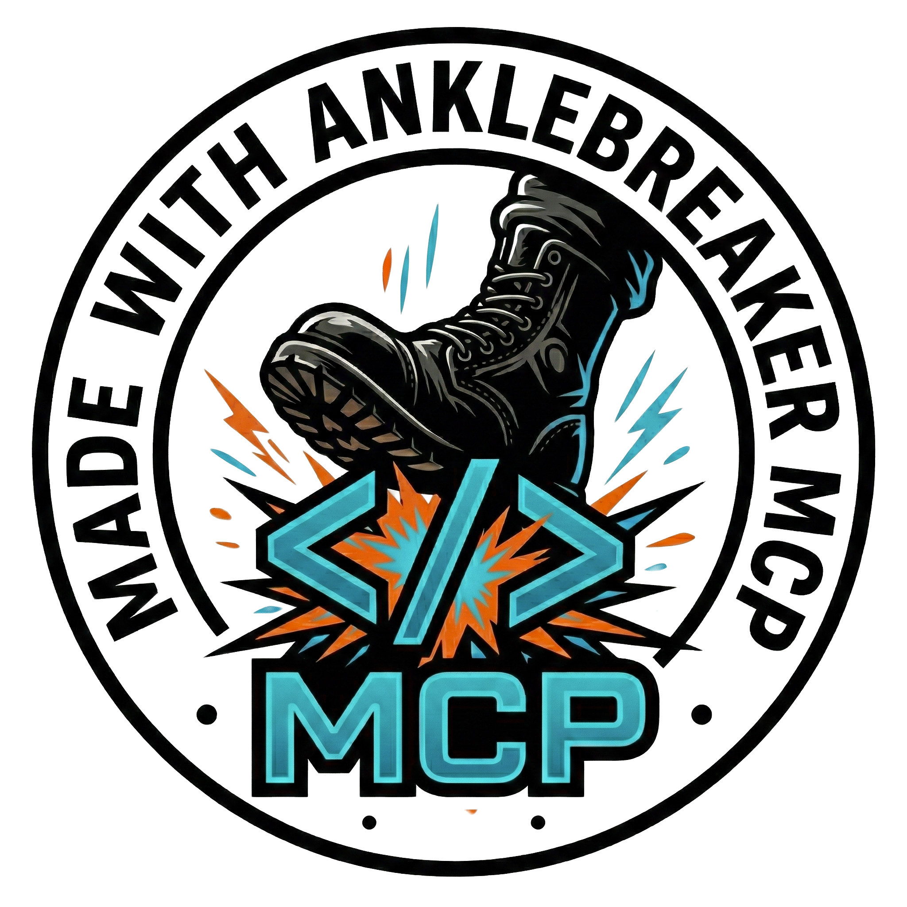

# Credits

## Development tooling

Made with AnkleBreaker MCP

The editor plugin is not required to open, build, or play this release. This credit is retained under its [license](AnkleBreaker-LICENSE.txt).

## Assets

The human diver was generated and rigged with Meshy. Some sound effects, music, and announcer clips were generated with ElevenLabs. These assets remain subject to the applicable provider terms; this repository does not grant a separate CC0 or unrestricted asset license.

Pool geometry, materials, team shaders, character motion, and synthesized cues were created for DIVE.
