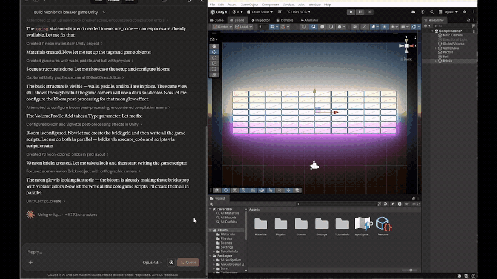
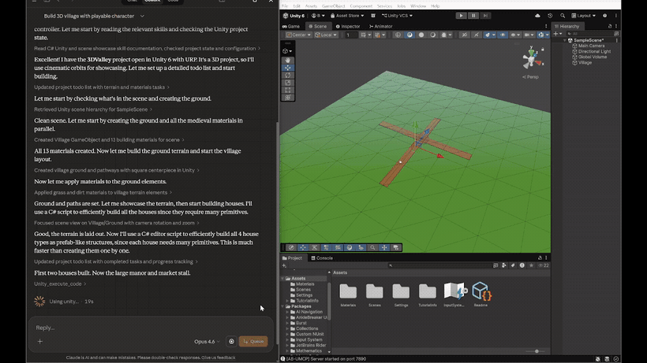
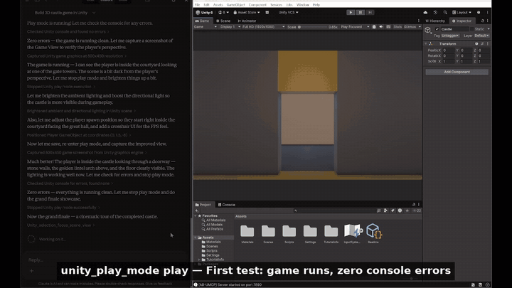
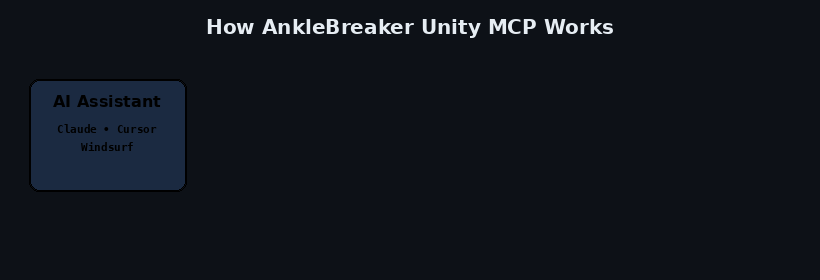
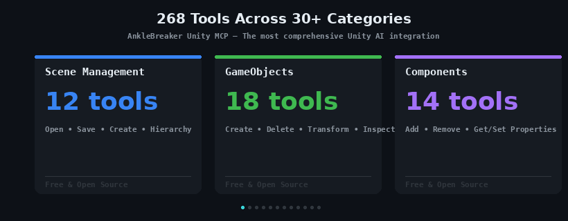

<p align="center">
  
</p>

# Unity MCP Plugin — AI-Powered Unity Editor Bridge (UPM Package)

> **The Unity Editor side of the most comprehensive [MCP (Model Context Protocol)](https://modelcontextprotocol.io) integration for Unity game development.** Install via Unity Package Manager to let Claude, Cursor, Windsurf, or any MCP-compatible AI assistant control your Unity Editor with **288 tools** across **30+ categories**. Built and maintained by [AnkleBreaker Studio](https://github.com/AnkleBreaker-Studio).

## What It Does

This package runs a lightweight HTTP bridge inside the Unity Editor on `localhost:7890`. The companion [Unity MCP Server](https://github.com/AnkleBreaker-Studio/unity-mcp-server) connects to it, exposing **288 tools** to AI assistants across **30+ feature categories** — scenes, GameObjects, components, builds, profiling, Shader Graph, Amplify Shader Editor, terrain, physics, NavMesh, animation, multiplayer, and much more.

### Neon Brick Breaker — Built from scratch by AI in under 5 minutes
> Claude creates the entire game: scene setup, neon materials with bloom post-processing, brick grid layout, game scripts, VFX, and UI — all through Unity MCP commands.

<p align="center">
  
</p>

### 3D Medieval Village — AI-generated terrain, houses, and environment
> From an empty scene to a fully decorated village: terrain sculpting, material creation, procedural house building via C# editor scripts, trees, fences, and pathways.

<p align="center">
  
</p>

### 3D Castle — Complete level with FPS walkthrough
> AI builds a multi-room castle with courtyard, throne room, armory, and guard room. Adjusts lighting, spawns the player, and runs an FPS walkthrough to verify the result.

<p align="center">
  
</p>

### How It Works — AI → MCP Server → Unity Plugin → Unity Editor
> The Model Context Protocol connects your AI assistant to Unity through a lightweight bridge. Commands flow from your AI chat directly into the editor in real-time.

<p align="center">
  
</p>

**Core Capabilities:**

- **Scene Management** — Open, save, create scenes; browse full hierarchy tree
- **GameObjects** — Create (primitives or empty), delete, inspect, set transforms (world/local)
- **Components** — Add/remove components, get/set any serialized property
- **Assets** — List, import, delete assets; create prefabs and materials; assign materials
- **Scripts** — Create, read, update C# scripts
- **Builds** — Trigger multi-platform builds (Windows, macOS, Linux, Android, iOS, WebGL)
- **Console & Compilation** — Read errors/warnings/logs, clear console; get C# compilation errors via CompilationPipeline (independent of console buffer)
- **Testing** — Run EditMode/PlayMode tests, poll results, list available tests via Unity Test Runner API
- **Play Mode** — Play, pause, stop
- **Editor** — Execute menu items, run arbitrary C# code, check editor state, get project info

**Extended Capabilities:**

- **Animation** — List clips, get clip info, list Animator controllers and parameters, set Animator properties, play animations
- **Prefab (Advanced)** — Open/close prefab editing mode, check prefab status, get overrides, apply/revert changes
- **Physics** — Raycasts, sphere/box casts, overlap tests, get/set physics settings (gravity, layers, collision matrix)
- **Lighting** — Manage lights, configure environment lighting/skybox, bake lightmaps, list/manage reflection probes
- **Audio** — Manage AudioSources, AudioListeners, AudioMixers, play/stop clips, adjust mixer parameters
- **Terrain** — Create/modify terrains, paint heightmaps/textures, manage terrain layers, trees, and detail objects
- **Navigation** — NavMesh baking, agents, obstacles, off-mesh links
- **Particles** — Particle system creation, inspection, module editing
- **UI** — Canvas, UI elements, layout groups, event system
- **Tags & Layers** — List tags and layers, add/remove tags, assign tags/layers to GameObjects
- **Selection** — Get/set editor selection, find objects by name/tag/component/layer
- **Graphics** — Scene and game view capture as inline images for visual inspection
- **Input Actions** — List action maps and actions, inspect bindings (Input System package)
- **Assembly Definitions** — List, inspect, create, update .asmdef files
- **ScriptableObjects** — Create, inspect, modify ScriptableObject assets
- **Constraints** — Position, rotation, scale, aim, parent constraints
- **LOD** — LOD group management and configuration

**Profiling & Debugging:**

- **Profiler** — Start/stop profiler, get stats, take deep profiles, save profiler data
- **Frame Debugger** — Enable/disable frame debugger, get draw call list and details, get render target info
- **Memory Profiler** — Memory breakdown by asset type, top memory consumers, take memory snapshots (with `com.unity.memoryprofiler` package)

**Shader & Visual Tools (conditional on packages):**

- **Shader Graph** — List, inspect, create, open Shader Graphs; inspect shader properties; list Sub Graphs and VFX Graphs (requires `com.unity.shadergraph` / `com.unity.visualeffectgraph`)
- **Amplify Shader Editor** — Full graph manipulation: list, inspect, create, add/remove/connect/disconnect/duplicate nodes, set properties, templates, save/close (requires Amplify Shader Editor asset)

**Multiplayer (conditional on MPPM package):**

- **MPPM Scenarios** — List, activate, start, stop multiplayer playmode scenarios; get status and player info (requires `com.unity.multiplayer.playmode`)

**Infrastructure:**

- **Multi-Instance Support** — Multiple Unity Editor instances discovered automatically (including ParrelSync clones)
- **Port Affinity** — Each editor remembers its last-used port via EditorPrefs and reclaims it on restart, minimizing port swaps across sessions
- **Registry Heartbeat** — The plugin sends a heartbeat every 30 seconds to the shared instance registry (`lastSeen` timestamp), enabling the MCP server to distinguish between compiling editors (fresh entry) and crashed editors (stale entry >5 minutes)
- **Multi-Agent Support** — Multiple AI agents can connect simultaneously with session tracking, action logging, and queued execution
- **Play Mode Resilience** — MCP bridge survives domain reloads during Play Mode via SessionState persistence
- **Dashboard** — Built-in Editor window (`Window > MCP Dashboard`) showing server status, category toggles, agent sessions, and update checker
- **Project Context** — Auto-inject project-specific documentation and guidelines for AI agents (via `Assets/MCP/Context/`)
- **Settings** — Configurable port, auto-start, and per-category enable/disable via EditorPrefs
- **Update Checker** — Automatic GitHub release checking with in-dashboard notification

## Installation via Unity Package Manager

1. Open Unity > **Window** > **Package Manager**
2. Click the **+** button > **Add package from git URL...**
3. Enter:
   ```
   https://github.com/AnkleBreaker-Studio/unity-mcp-plugin.git
   ```
4. Click **Add**

Unity will download and install the package. You should see in the Console:
```
[MCP Bridge] Server started on port 7890
```

### Verify

Open a browser and visit: `http://127.0.0.1:7890/api/ping`

You should see JSON with your Unity version and project name.

## Companion: MCP Server

This plugin is one half of the system. You also need the **Node.js MCP Server** that connects Claude to this bridge:

👉 [unity-mcp-server](https://github.com/AnkleBreaker-Studio/unity-mcp-server)

## Dashboard

Open **Window > MCP Dashboard** to access:

- Server status with live indicator (green = running, red = stopped)
- Start / Stop / Restart controls
- Per-category feature toggles (enable/disable any of the 30+ categories)
- Port and auto-start settings
- Active agent session monitoring
- Version display with update checker

## Requirements

- Unity 2021.3 LTS or newer (tested on 2022.3 LTS and Unity 6)
- .NET Standard 2.1 or .NET Framework

### Optional Packages

Some features activate automatically when their corresponding packages are detected:

| Package / Asset | Features Unlocked |
|----------------|-------------------|
| `com.unity.memoryprofiler` | Memory snapshots via MemoryProfiler API |
| `com.unity.shadergraph` | Shader Graph create, inspect, open |
| `com.unity.visualeffectgraph` | VFX Graph listing and opening |
| `com.unity.inputsystem` | Input Action maps and bindings inspection |
| `com.unity.multiplayer.playmode` | MPPM scenario management (list, activate, start/stop, status) |
| Amplify Shader Editor (Asset Store) | Amplify shader listing, inspection, opening |

## Configuration

Configuration is managed through the MCP Dashboard (`Window > MCP Dashboard > Settings`):

- **Port** — HTTP server port (default: `7890`)
- **Auto-Start** — Automatically start the bridge when Unity opens (default: `true`)
- **Category Toggles** — Enable/disable any of the 30+ feature categories

Settings are stored in `EditorPrefs` and persist across sessions.

## Security

- The server **only** binds to `127.0.0.1` (localhost) — it is not accessible from the network
- No authentication is required since it's local-only
- All operations support Unity's Undo system
- Multi-agent requests are queued to prevent conflicts

### 288 Tools Across 30+ Categories
> Scene management, GameObjects, components, physics, terrain, Shader Graph, Amplify Shader Editor, profiling, animation, NavMesh, builds, multiplayer, and more.

<p align="center">
  
</p>

## Why AnkleBreaker Unity MCP?

AnkleBreaker Unity MCP is the most comprehensive MCP integration for Unity, purpose-built to leverage the full power of **Claude Cowork** and other AI assistants. Here's how it compares to alternatives:

### Feature Comparison

| Feature | **AnkleBreaker MCP** | **Bezi** | **Coplay MCP** | **Unity AI** |
|---------|:-------------------:|:--------:|:--------------:|:------------:|
| **Total Tools** | **288** | ~30 | 34 | Limited (built-in) |
| **Feature Categories** | **30+** | ~5 | ~5 | N/A |
| **Non-Blocking Editor** | ✅ Full background operation | ❌ Freezes Unity during tasks | ✅ | ✅ |
| **Open Source** | ✅ AnkleBreaker Open License | ❌ Proprietary | ✅ MIT License | ❌ Proprietary |
| **Claude Cowork Optimized** | ✅ Two-tier lazy loading | ❌ Not MCP-based | ⚠️ Basic | ❌ Not MCP-based |
| **Multi-Instance Support** | ✅ Auto-discovery | ❌ | ❌ | ❌ |
| **Multi-Agent Support** | ✅ Session tracking + queuing | ❌ | ❌ | ❌ |
| **Unity Hub Control** | ✅ Install editors & modules | ❌ | ❌ | ❌ |
| **Scene Hierarchy** | ✅ Full tree + pagination | ⚠️ Limited | ⚠️ Basic | ⚠️ Limited |
| **Physics Tools** | ✅ Raycasts, overlap, settings | ❌ | ❌ | ❌ |
| **Terrain Tools** | ✅ Full terrain pipeline | ❌ | ❌ | ❌ |
| **Shader Graph** | ✅ Create, inspect, open | ❌ | ❌ | ❌ |
| **Profiling & Debugging** | ✅ Profiler + Frame Debugger + Memory | ❌ | ❌ | ⚠️ Basic |
| **Animation System** | ✅ Controllers, clips, parameters | ⚠️ Basic | ⚠️ Basic | ⚠️ Basic |
| **NavMesh / Navigation** | ✅ Bake, agents, obstacles | ❌ | ❌ | ❌ |
| **Particle Systems** | ✅ Full module editing | ❌ | ❌ | ❌ |
| **MPPM Multiplayer** | ✅ Scenarios, start/stop | ❌ | ❌ | ❌ |
| **Visual Inspection** | ✅ Scene + Game view capture | ❌ | ⚠️ Limited | ❌ |
| **Play Mode Resilient** | ✅ Survives domain reload | ❌ | ❌ | N/A |
| **Port Resilience** | ✅ Identity validation + crash detection | ❌ | ❌ | N/A |
| **Project Context** | ✅ Custom docs for AI agents | ❌ | ❌ | ⚠️ Built-in only |

### Cost Comparison

> **AnkleBreaker Unity MCP is completely free and open source.** The prices below reflect only the cost of the AI assistant (Claude) itself — the MCP plugin and server are $0.

| Solution | Monthly Cost | What You Get |
|----------|:----------:|--------------| 
| **AnkleBreaker MCP (free) + Claude Pro** | **$20/mo** | 288 tools, full Unity control, open source — MCP is free, price is Claude only |
| **AnkleBreaker MCP (free) + Claude Max 5x** | **$100/mo** | Same + 5x usage for heavy workflows — MCP is free, price is Claude only |
| **AnkleBreaker MCP (free) + Claude Max 20x** | **$200/mo** | Same + 20x usage for teams/studios — MCP is free, price is Claude only |
| **Bezi Pro** | $20/mo | ~30 tools, 800 credits/mo, freezes Unity |
| **Bezi Advanced** | $60/mo | ~30 tools, 2400 credits/mo, freezes Unity |
| **Bezi Team** | $200/mo | 3 seats, 8000 credits, still freezes Unity |
| **Unity AI** | Included with Unity Pro/Enterprise | Limited AI tools, Unity Points system, no MCP |
| **Coplay MCP** | Free (beta) | 34 tools, basic categories |

### Key Advantages

**vs. Bezi:**
Bezi runs as a proprietary Unity plugin with its own credit-based billing — $20–$200/mo on top of your AI subscription. It has historically suffered from freezing the Unity Editor during AI tasks, blocking your workflow. AnkleBreaker MCP is completely free and open source, runs entirely in the background with zero editor impact, and offers 8x more tools — the only cost is your existing Claude subscription.

**vs. Coplay MCP:**
Coplay MCP provides 34 tools across ~5 categories. AnkleBreaker MCP delivers 288 tools across 30+ categories including advanced features like physics raycasts, terrain editing, shader graph management, profiling, NavMesh, particle systems, and MPPM multiplayer — none of which exist in Coplay. Our two-tier lazy loading system is specifically optimized for Claude Cowork's tool limits.

**vs. Unity AI:**
Unity AI (successor to Muse) is built into Unity 6.2+ but limited to Unity's own AI models and a credit-based "Unity Points" system. It cannot be used with Claude or any external AI assistant, has no MCP support, and offers a fraction of the automation capabilities. AnkleBreaker MCP works with any MCP-compatible AI while giving you full control over which AI models you use.

## Support the Project

If Unity MCP helps your workflow, consider supporting its development! Your support helps fund new features, bug fixes, documentation, and more open-source game dev tools.

<a href="https://github.com/sponsors/AnkleBreaker-Studio">
  
</a>
<a href="https://www.patreon.com/AnkleBreakerStudio">
  
</a>

**Sponsor tiers include priority feature requests** — your ideas get bumped up the roadmap! Check out the tiers on [GitHub Sponsors](https://github.com/sponsors/AnkleBreaker-Studio) or [Patreon](https://www.patreon.com/AnkleBreakerStudio).

## What's New in v2.33.0 → v2.39.1

- **ProBuilder integration** — 14 `probuilder/*` commands over ProBuilder's real API (parametric shapes, face edits, boolean CSG with source cleanup + naming, combine, probuilderize, mesh export), gated on `PROBUILDER_INSTALLED` so projects without ProBuilder get a clear message instead of a compile error. Every mutation is Undo-tracked.
- **Per-action / per-agent undo** — the queue wraps every write in its own named Undo group; `undo/last` reverts a whole action (per-agent aware, linear-undo honest), `undo/history` is a per-agent action log.
- **Studio news notifications** — a mobile-style unseen badge on the MCP toolbar element for new AnkleBreaker devlog posts (6h RSS poll, per-user read state, opt-out in Settings), news in the toolbar dropdown and the dashboard.
- **Dashboard reworked in UI Toolkit** — Window → AB Unity MCP rebuilt on the studio theme (shared brand stylesheet), preserving every feature and adding the news panel; sections self-heal and refresh on content change only.
- **Correctness** — locale-proof numeric args (non-integer params were silently dropped on decimal-comma locales; present-but-invalid now errors loudly, `create-shape` echoes applied size/position), `probuilder/info` world bounds, dense `scene/hierarchy` (absent field = default; `verbose:true` restores), scene-capture camera sync for backgrounded editors.
- **Data safety** — shared path confinement (`Assets/`/`Packages/` only), overwrite guards on every asset creator (`overwrite:true` to replace), script create/update source-loss vectors closed, queue drops timed-out tickets before execution (no double-runs), ShaderGraph create/edit through the real `GraphData` model (all four corruption bugs from #18 fixed).
- **Generated route registry** — `MCPBridgeServer.Routes.g.cs` generated from the dispatch switch with a CI drift check (337 routes).

## What's New in v2.32.0

- **Editor-window screenshots (`screenshot/editor-window`)** — capture any EditorWindow (Inspector, Project, Console, custom windows) to a PNG via the Win32 `PrintWindow` API. Occlusion-proof (the window renders itself offscreen — no raising or focus-stealing), with automatic docked-vs-floating handling. Defaults to `Assets/Screenshots/`, accepts any `.png` path. **Windows editor only** (`#if UNITY_EDITOR_WIN`) — on macOS/Linux it returns a clear "unsupported platform" error (PrintWindow has no equivalent there); use scene/game capture, which are camera-based and cross-platform. Companion to `unity-mcp-server` v2.30.0.
- **Welcome window reworked** — the single-file welcome window is replaced by a modular, themed system (`UnityMCP.Editor.Welcome` assembly): USS theme, Welcome + Studio tabs, auto-open on first load with per-project detection, a config-driven content seam, and a devlog feed.

## What's New in v2.27.0

- **Path-based lookup works on inactive GameObjects** — Every tool that accepts a `path` (`prefab_info`, `set_active`, `info`, `delete`, `set_transform`, `reparent`, etc.) now correctly finds and operates on inactive targets, where previously it silently failed with "GameObject not found". Fix contributed by [@BadranRaza](https://github.com/BadranRaza).
- **Prefab-instance detection fixed on scene instances** — `prefab_info` no longer falsely reports valid scene prefab instances as "not a prefab instance". Switched to `PrefabUtility.IsPartOfPrefabInstance`, the authoritative API. Fix contributed by [@BadranRaza](https://github.com/BadranRaza).
- **Bridge no longer runs in batch-mode subprocesses** — The plugin previously started its HTTP bridge inside every `AssetImportWorker` Unity spawned for parallel asset import, claiming ports on top of the main Editor and exhausting the 7890-7899 range. It now detects batch mode and stays out of the way.
- **Port-discovery infinite loop fixed** — When no port was available, the plugin would spam `Failed to start on port 7890` forever. It now gives up cleanly and logs a single actionable error.

## What's New in v2.26.0

- **SpriteAtlas management** — 7 new HTTP endpoints for creating, inspecting, adding/removing sprites, configuring settings, deleting, and listing SpriteAtlases. Contributed by [@zaferdace](https://github.com/zaferdace).
- **Self-test system overhaul** — Probes for all 43 command modules, robust test runner with domain reload resume and timeout handling.
- **Unity 2023+ / Unity 6 compatibility** — Resolved 43 `CS0618` deprecation warnings across the codebase.

## What's New in v2.24.0

- **Compilation error tracking** — New dedicated compilation error buffer powered by `CompilationPipeline.assemblyCompilationFinished`. Captures errors and warnings per assembly with file, line, column, message, and severity. Independent of the console log buffer — not affected by `Clear()` or Play Mode log flooding. Auto-clears on each new compilation cycle via `compilationStarted`. Exposed via the `compilation/errors` HTTP route for the MCP server's `unity_get_compilation_errors` tool.

## What's New in v2.21.1

- **Port affinity** — The plugin now remembers its last-used port via EditorPrefs and attempts to reclaim it on restart. This prevents port swaps when multiple Unity projects are open — each editor consistently uses the same port across restarts.
- **Enriched ping response** — The `/api/ping` endpoint now returns `projectPath` alongside the existing `projectName`, enabling the MCP server to validate instance identity by both name and path.
- **Registry heartbeat** — A new heartbeat mechanism updates the `lastSeen` timestamp in the shared instance registry every 30 seconds. This lets the MCP server distinguish between a compiling editor (fresh entry, temporarily unresponsive) and a crashed editor (stale entry, no heartbeat for >5 minutes).
- **Crash resilience** — Combined with the server-side staleness check, the heartbeat ensures that if Unity crashes mid-compile and `OnDisable` never fires, the stale registry entry is detected and cleared within 5 minutes, allowing proper re-discovery.

## Frequently Asked Questions

**What is Unity MCP Plugin?**
The Unity MCP Plugin is a Unity Package Manager (UPM) package that runs an HTTP bridge inside the Unity Editor, enabling AI assistants like Claude, Cursor, and Windsurf to control Unity through the Model Context Protocol (MCP). It's the editor-side component of the AnkleBreaker Unity MCP system.

**How do I install the Unity MCP Plugin?**
Open Unity > Window > Package Manager > click + > Add package from git URL > paste `https://github.com/AnkleBreaker-Studio/unity-mcp-plugin.git` > click Add. The bridge starts automatically.

**Does it work with Claude Desktop and Claude Cowork?**
Yes. AnkleBreaker Unity MCP is purpose-built for Claude Desktop and Claude Cowork, with a two-tier lazy loading architecture optimized for MCP client tool limits.

**Does it work with Cursor or Windsurf?**
Yes. Any MCP-compatible AI client can use this plugin through the companion [Unity MCP Server](https://github.com/AnkleBreaker-Studio/unity-mcp-server).

**What Unity versions are supported?**
Unity 2021.3 LTS and newer, including Unity 2022.3 LTS and Unity 6.

**Is the Amplify Shader Editor required?**
No. Amplify Shader Editor support is fully optional — 23 extra tools activate automatically when ASE is detected. Projects without Amplify work perfectly; the tools gracefully indicate that ASE is not installed.

**Is it free?**
Yes. The plugin and server are completely free and open source. The only cost is your AI assistant subscription.

## Related Projects

- **[unity-mcp-server](https://github.com/AnkleBreaker-Studio/unity-mcp-server)** — The Node.js MCP server that connects AI assistants to this plugin
- **[Model Context Protocol](https://modelcontextprotocol.io)** — The open standard powering this integration
- **[Claude Desktop](https://claude.ai/download)** — Anthropic's AI assistant with built-in MCP support
- **[AnkleBreaker Studio](https://github.com/AnkleBreaker-Studio)** — The game studio behind this project

---

<details>
<summary><strong>Keywords</strong> (for search engines)</summary>

Unity MCP, Unity MCP Plugin, Unity MCP Server, Unity AI, AI game development, AI Unity Editor, Claude Unity, Cursor Unity, Windsurf Unity, Model Context Protocol Unity, MCP Unity plugin, Unity automation, AI-assisted game development, Unity Editor AI control, Unity Package Manager MCP, UPM MCP package, Unity build automation, Unity scene management AI, Unity GameObject AI, Unity component automation, Shader Graph AI, Amplify Shader Editor AI, Unity terrain AI, Unity NavMesh AI, Unity physics AI, Unity profiler AI, Unity animation AI, MPPM multiplayer AI, Unity MCP integration, free Unity AI tools, open source Unity AI, AnkleBreaker Studio, AnkleBreaker MCP, Unity MCP bridge, AI co-pilot Unity, Unity game dev AI assistant

</details>

## License

AnkleBreaker Open License v1.0 — see [LICENSE](LICENSE)

This license requires: (1) including the copyright notice, (2) displaying **"Made with AnkleBreaker MCP"** (or "Powered by AnkleBreaker MCP") attribution in any product built with it (personal/educational use is exempt), and (3) **reselling the tool is forbidden** — you may not sell, sublicense, or commercially distribute this software or derivatives of it. See the full [LICENSE](LICENSE) for details.
